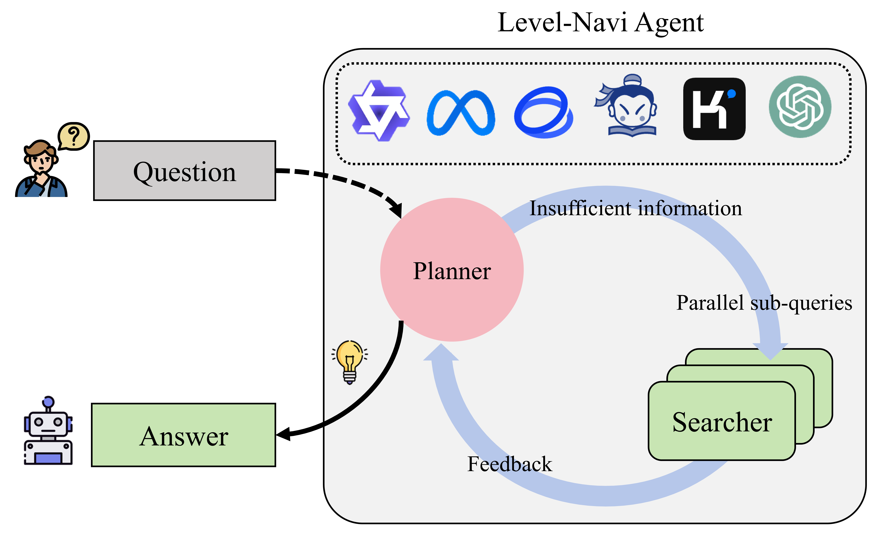
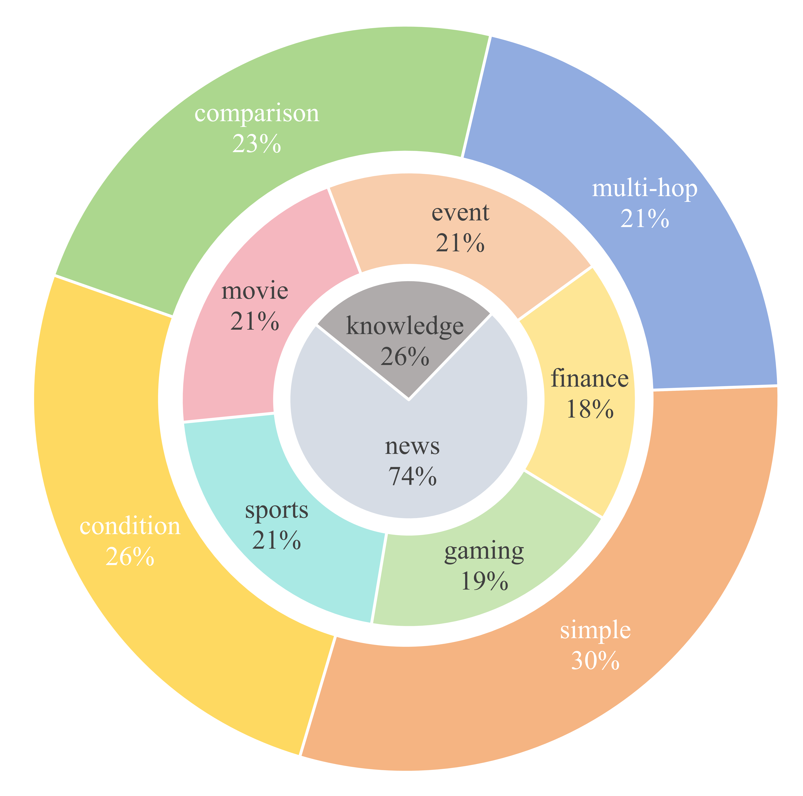

# Level-Navi Agent

This repository is the official repository for the paper Level-Navi Agent: A Benchmark and Framework for Chinese Web Search Agents.

## 🌐 Project Introduction

Level-Navi Agent is an open-source, general-purpose web search agent framework where any open or closed-source model can be deployed. Our agent is capable of breaking down and understanding complex questions, iteratively searching for information on the internet step by step, until it can answer the user's original question.

<div style="text-align: center;">
    <figure style="display: inline-block; text-align: center;">
        
        <figcaption>*Framework of Level-Navi Agent</figcaption>
    </figure>
</div>

To comprehensively evaluate the performance of various models on web search tasks, we provide an open-source dataset - Web24 Dataset. The total number of samples in our dataset is 481, and all questions come from five major domains: finance, gaming, sports, movies, and events. Our classification comes from scenarios that people usually search for on the internet. To avoid interference from the model's internal knowledge to the framework, the main source of our dataset is news (before December 2024), and we ensure that there are credible information source links. Questions are divided into simple, conditional, comparative, and multi-hop, covering a variety of questioning scenarios.

<div style="text-align: center;">
    <figure style="display: inline-block; text-align: center;">
        
        <figcaption>*Web24 Dataset Composition</figcaption>
    </figure>
</div>

Here we provide some model test results, and more comprehensive experiments and analysis can be obtained in the paper.


| Model               | Few-shot    | $S_{final}$ | $S_{co}$ | $S_{rele}$ | $S_{simi}$ | $S_c$ | Pass rate |
|---------------------|-------------|-------------|----------|------------|------------|-------|-----------|
| **Internlm2.5-7B**  | zero-shot   | 49.48       | 0.47     | 0.81       | 0.56       | 2.62  | 0.92      |
|                     | three-shot  | 49.31       | 0.47     | 0.80       | 0.56       | 2.65  | 0.95      |
| **Internlm2.5-20B** | zero-shot   | 55.02       | 0.57     | 0.80       | 0.57       | 3.62  | 0.93      |
|                     | three-shot  | 55.43       | 0.57     | 0.80       | 0.57       | 2.69  | 0.97      |
| **GLM-4-9B**        | zero-shot   | 63.25       | 0.66     | 0.83       | 0.67       | 2.16  | 0.94      |
|                     | three-shot  | 43.43       | 0.37     | 0.81       | 0.56       | 2.69  | 0.92      |
| **Qwen2.5-3B**      | zero-shot   | 60.17       | 0.62     | 0.84       | 0.64       | 2.56  | 0.85      |
|                     | three-shot  | 60.45       | 0.63     | 0.84       | 0.59       | 2.12  | 0.86      |
| **Qwen2.5-7B**      | zero-shot   | 63.12       | 0.65     | 0.85       | 0.60       | 1.44  | 0.99      |
|                     | three-shot  | 65.84       | 0.70     | 0.84       | 0.62       | 1.64  | 1.00      |
| **Qwen2.5-14B**     | zero-shot   | 68.34       | 0.75     | 0.84       | 0.61       | 1.84  | 0.99      |
|                     | three-shot  | 68.39       | 0.75     | 0.84       | 0.61       | 1.81  | 1.00      |
| **Llama3.1-8B**     | zero-shot   | 37.02       | 0.30     | 0.74       | 0.51       | 3.60  | 0.88      |
|                     | three-shot  | 32.45       | 0.27     | 0.61       | 0.46       | 3.89  | 0.93      |

## 📝 Quick Start

按照以下步骤快速启动项目：

### 1. Clone the Project

Follow these steps to quickly start the project:

```bash
git clone [project address]
```

### 2. Set Up Environment

Use conda to create a Python 3.11 virtual environment:

```bash
conda create --name ai_search python=3.11
```

### 3. Install Dependencies

Enter the project directory and install dependencies:

```bash
cd [project directory]
pip install -r requirements.txt
```

### 4. Configure Search Engine API

Obtain a [Bing API Key](https://www.microsoft.com/en-us/bing/apis/bing-web-search-api)，and configure it in the configuration file(config/.env)(`BING_API`)

### 5. API/Local Mode

#### API Deployment
Obtain an OpenAI API Key，choose a model name, and configure it in the [configuration file](config/.env)(`API_KEY`, `MODEL_NAME`)

#### Local Model Deployment
Use vllm to deploy the local model in server mode.

Configure the model name/path MODEL_NAME_OR_PATH [script file](example/vllm_openai.sh) 

Change  API_BASE='http://localhost:8001/v1' in the [configuration file](config/.env)

Start the vllm service:
```bash
cd example
bash vllm_openai.sh
```

### 6. Start Testing

Activate the virtual environment and run the example code for testing:

```bash
cd example 
python terminal.py
```

### Test Example

```
输入：北京今天的天气怎么样？

返回示例响应：

北京2024年12月12日的天气预报如下：

- **天气状况**：多云转小雪
- **温度**：
  - 白天最高温度：4°C
  - 夜间最低温度：-3°C
- **风向风力**：
  - 白天：西南风，微风
  - 夜间：北风，微风
- **空气质量**：良好，可以正常参加户外活动，AQI为60，属于“良”级别。

建议出门时携带雨具，并注意防滑，尤其是在夜间和早晨。希望这些信息对您有所帮助！
```

```
输入：OpenAI o1 有什么值得关注的点？

返回示例响应：

### OpenAI o1 的主要特点和值得关注的点

#### 主要特点

1. **强化学习（Reinforcement Learning, RL）训练**：
   - o1 模型接受了强化学习训练，这是其核心特点之一。通过强化学习，模型能够根据反馈不断优化其输出，从而提高性能。

2. **更长的内部思维链（Chain of Thought, CoT）**：
   - 在模型推理时，o1 采用了更长的内部思维链。这意味着模型在回答问题之前会进行更深入的思考，将问题分解成更小的步骤逐一解决，从而生成更准确和合理的答案。

3. **强大的逻辑推理能力**：
   - o1 在物理、化学、数学等强逻辑领域表现出色。例如，在美国数学奥林匹克预选赛（AIME）中，o1 的准确率达到了74%，远超GPT-4的12%。在GPQA Diamond测试中，o1 超过了PhD级别的人类专家。

4. **拟人化的推理模式**：
   - o1 在回答问题时会进入拟人化思考模式，这种模式使得模型能够更好地理解问题的本质，分析问题的各个方面，从而给出更准确和合理的答案。

5. **自适应强化学习和纠错**：
   - o1 通过大规模的强化学习算法进行训练，能够不断优化自己的策略，识别和纠正错误，学会将复杂的步骤分解为更简单的部分，并在当前方法不奏效时尝试不同的方法来解决。

#### 值得关注的点

1. **训练和推理算力的增加**：
   - 由于引入了强化学习和更长的内部思维链，o1 在后训练和推理阶段需要更多的算力。这可能对硬件和计算资源提出更高的要求。

2. **多领域泛化能力的提升**：
   - 随着RL和CoT的不断迭代，o1 及后续模型有望出现“涌现”现象，将能力泛化到强逻辑以外的通用问题领域，这可能对复杂AI应用的迭代和发展产生重要影响。

3. **应用场景的扩展**：
   - o1 的强大推理能力使其在教育、科研、编程竞赛等多个领域都有广泛的应用前景。例如，它可以用于辅助教学、解决复杂的科研问题、编写复杂的代码等。

4. **技术进步的不确定性**：
   - 尽管o1 展示了强大的性能，但AI技术的进步仍然存在不确定性。宏观经济波动、技术发展不及预期等因素都可能影响o1 及其后续模型的发展。

5. **国内算力链和AI应用的发展**：
   - o1 的发布为国内算力链、苹果链和核心AI应用相关公司带来了新的机遇和挑战。建议关注这些领域的动态，以抓住潜在的投资机会。

### 总结
OpenAI o1 模型通过强化学习和更长的内部思维链，显著提升了在物理、化学、数学等强逻辑领域的性能。其拟人化的推理模式和自适应强化学习能力使其在多个应用场景中展现出巨大的潜力。然而，这也带来了对算力和计算资源的更高要求，值得相关企业和研究机构关注。
```
## 🏆 Benchmark

### 🚶🏼‍♂ Running Tests

Script for evaluating open-source models：[open_model_terminal.sh](example/run_benchmark/open_model_terminal.sh)

Set running parameters：

- `MODEL_NAME_OR_PATH` Model path/name
- `ALL_GPUS` Total number of hardware units
- `NUM_SERVICES` Number of vllm backend services
- `GPUS_PER_SERVICE` Number of GPUs used per service

```bash
cd example/run_benchmark
bash open_model_terminal.sh
```

Results are stored at：[data/metrics_rlts](data/metrics_rlts)

### 🔍️ Evaluation

Choose the name of the large model to be used as the evaluator and configure it in the [configuration file](config/.env)(`EVALUATOR_NAME`)

Evaluation script：[llm_eval_terminal.sh](example/eval/llm_eval_terminal.sh)

Evaluate all jsonl files under `data/metrics_rlts`

```bash
cd example/eval
bash llm_eval_terminal.sh
```

## ✨️ Citation

If our project has inspired your research/work, please cite it in the following format:
```
@article{chen2024mindsearch,
  title={},
  author={},
  journal={},
  year={2024}
}
```
