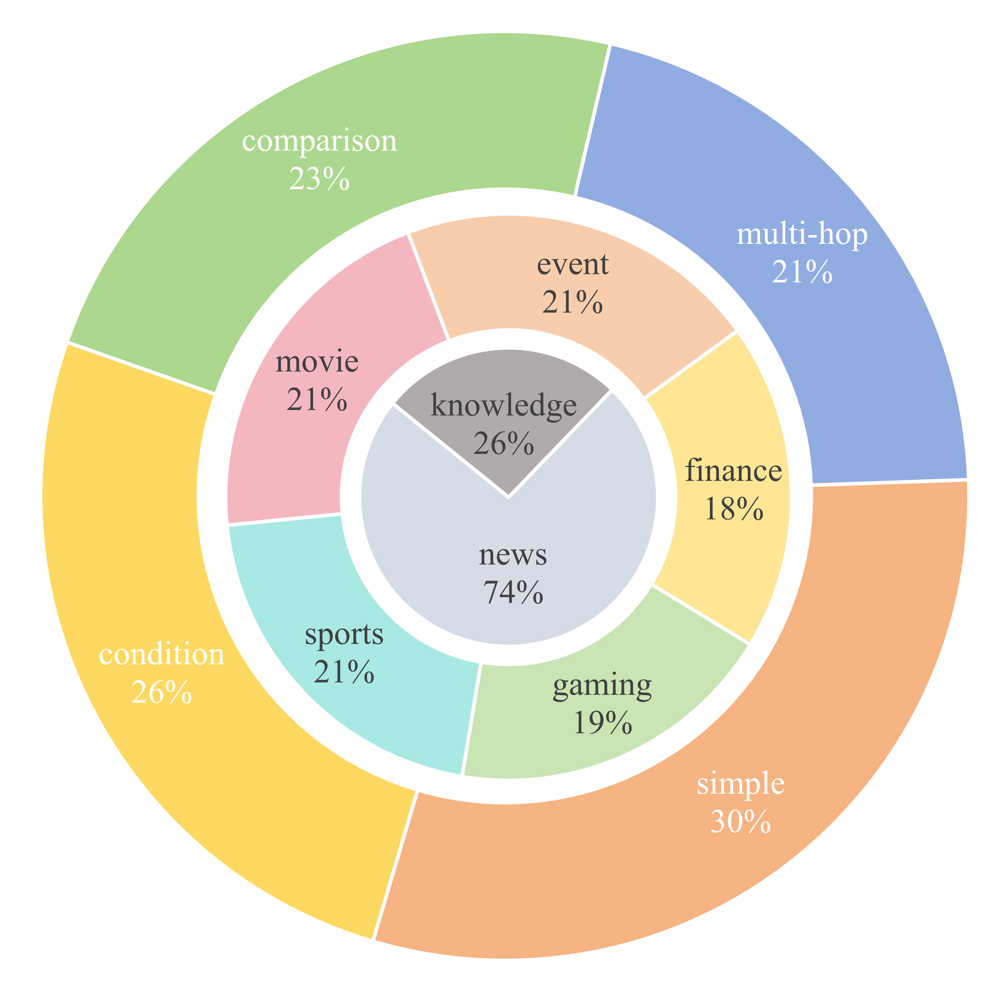

# Level-Navi Agent

本仓库是 *[Level-Navi Agent: A Benchmark and Framework for Chinese Web Search Agents](xxx)* 论文的官方仓库。

## 🌐 项目简介

Level-Navi Agent是一个开源通用的网络搜索agent框架，任何开源闭源模型都可以在本框架内进行部署。我们的agent能够拆分理解复杂问题，一步步迭代搜索互联网上的信息，直到能够回答用户最初的问题。

<div style="text-align: center;">
    <figure style="display: inline-block; text-align: center;">
        
        <figcaption>Level-Navi Agent的框架</figcaption>
    </figure>
</div>

为了全面评估各类模型在网络搜索任务下的性能，我们提供了一个开源数据集--Web24 Dataset, 我们的数据集的总样本数为481，所有的问题都来源于五大领域，财经，游戏，体育，电影，事件。我们的分类来源于平时会在网络上进行搜索的场景。为了避免模型内部的知识对框架的干扰，我们的数据集的主要信息来源为新闻（2024年12月前），并且保证有可信度较高的信息来源链接。问题分为简单，条件，比较和多跳，涵盖了多样提问场景。

<div style="text-align: center;">
    <figure style="display: inline-block; text-align: center;">
        
        <figcaption>Web24数据集的构成</figcaption>
    </figure>
</div>

这里我们提供了部分模型的测试结果，更全面的实验和分析可以在[论文](xxx)中获取。

| Model               | Few-shot    | $S_{final}$ | $S_{co}$ | $S_{rele}$ | $S_{simi}$ | $S_c$ | Pass rate |
|---------------------|-------------|-------------|----------|------------|------------|-------|-----------|
| **Internlm2.5-7B**  | zero-shot   | 49.48       | 0.47     | 0.81       | 0.56       | 2.62  | 0.92      |
|                     | three-shot  | 49.31       | 0.47     | 0.80       | 0.56       | 2.65  | 0.95      |
| **Internlm2.5-20B** | zero-shot   | 55.02       | 0.57     | 0.80       | 0.57       | 3.62  | 0.93      |
|                     | three-shot  | 55.43       | 0.57     | 0.80       | 0.57       | 2.69  | 0.97      |
| **GLM-4-9B**        | zero-shot   | 63.25       | 0.66     | 0.83       | 0.67       | 2.16  | 0.94      |
|                     | three-shot  | 43.43       | 0.37     | 0.81       | 0.56       | 2.69  | 0.92      |
| **Qwen2.5-3B**      | zero-shot   | 60.17       | 0.62     | 0.84       | 0.64       | 2.56  | 0.85      |
|                     | three-shot  | 60.45       | 0.63     | 0.84       | 0.59       | 2.12  | 0.86      |
| **Qwen2.5-7B**      | zero-shot   | 63.12       | 0.65     | 0.85       | 0.60       | 1.44  | 0.99      |
|                     | three-shot  | 65.84       | 0.70     | 0.84       | 0.62       | 1.64  | 1.00      |
| **Qwen2.5-14B**     | zero-shot   | 68.34       | 0.75     | 0.84       | 0.61       | 1.84  | 0.99      |
|                     | three-shot  | 68.39       | 0.75     | 0.84       | 0.61       | 1.81  | 1.00      |
| **Llama3.1-8B**     | zero-shot   | 37.02       | 0.30     | 0.74       | 0.51       | 3.60  | 0.88      |
|                     | three-shot  | 32.45       | 0.27     | 0.61       | 0.46       | 3.89  | 0.93      |

## 📝 快速开始

按照以下步骤快速启动项目：

### 1. 拉取项目

首先，克隆项目到本地：

```bash
git clone 项目地址
```

### 2. 建立环境

使用 conda 创建 Python 3.11 的虚拟环境：

```bash
conda create --name ai_search python=3.11
```

### 3. 安装依赖

进入项目目录并安装依赖：

```bash
cd 项目目录
pip install -r requirements.txt
```

### 4. 配置搜索引擎API

获取[Bing API Key](https://www.microsoft.com/en-us/bing/apis/bing-web-search-api)，并配置到[配置文件](config/.env)(`BING_API`)中

### 5. API/本地模型

#### API部署
获取OpenAI API Key，选择模型名称，配置到[配置文件](config/.env)(`API_KEY`, `MODEL_NAME`)中

#### 本地模型部署
使用vllm来以服务器形式部署本地模型

[脚本文件](example/vllm_openai.sh)中配置模型名称/路径 `MODEL_NAME_OR_PATH`

[配置文件](config/.env)中更改`API_BASE='http://localhost:8001/v1'`

启动vllm服务：
```bash
cd example
bash vllm_openai.sh
```

### 6. 启动测试

激活虚拟环境并运行示例代码进行测试：

```bash
cd example 
python terminal.py
```

### 测试示例

```
输入：北京今天的天气怎么样？

返回示例响应：

北京2024年12月12日的天气预报如下：

- **天气状况**：多云转小雪
- **温度**：
  - 白天最高温度：4°C
  - 夜间最低温度：-3°C
- **风向风力**：
  - 白天：西南风，微风
  - 夜间：北风，微风
- **空气质量**：良好，可以正常参加户外活动，AQI为60，属于“良”级别。

建议出门时携带雨具，并注意防滑，尤其是在夜间和早晨。希望这些信息对您有所帮助！
```

```
输入：OpenAI o1 有什么值得关注的点？

返回示例响应：

### OpenAI o1 的主要特点和值得关注的点

#### 主要特点

1. **强化学习（Reinforcement Learning, RL）训练**：
   - o1 模型接受了强化学习训练，这是其核心特点之一。通过强化学习，模型能够根据反馈不断优化其输出，从而提高性能。

2. **更长的内部思维链（Chain of Thought, CoT）**：
   - 在模型推理时，o1 采用了更长的内部思维链。这意味着模型在回答问题之前会进行更深入的思考，将问题分解成更小的步骤逐一解决，从而生成更准确和合理的答案。

3. **强大的逻辑推理能力**：
   - o1 在物理、化学、数学等强逻辑领域表现出色。例如，在美国数学奥林匹克预选赛（AIME）中，o1 的准确率达到了74%，远超GPT-4的12%。在GPQA Diamond测试中，o1 超过了PhD级别的人类专家。

4. **拟人化的推理模式**：
   - o1 在回答问题时会进入拟人化思考模式，这种模式使得模型能够更好地理解问题的本质，分析问题的各个方面，从而给出更准确和合理的答案。

5. **自适应强化学习和纠错**：
   - o1 通过大规模的强化学习算法进行训练，能够不断优化自己的策略，识别和纠正错误，学会将复杂的步骤分解为更简单的部分，并在当前方法不奏效时尝试不同的方法来解决。

#### 值得关注的点

1. **训练和推理算力的增加**：
   - 由于引入了强化学习和更长的内部思维链，o1 在后训练和推理阶段需要更多的算力。这可能对硬件和计算资源提出更高的要求。

2. **多领域泛化能力的提升**：
   - 随着RL和CoT的不断迭代，o1 及后续模型有望出现“涌现”现象，将能力泛化到强逻辑以外的通用问题领域，这可能对复杂AI应用的迭代和发展产生重要影响。

3. **应用场景的扩展**：
   - o1 的强大推理能力使其在教育、科研、编程竞赛等多个领域都有广泛的应用前景。例如，它可以用于辅助教学、解决复杂的科研问题、编写复杂的代码等。

4. **技术进步的不确定性**：
   - 尽管o1 展示了强大的性能，但AI技术的进步仍然存在不确定性。宏观经济波动、技术发展不及预期等因素都可能影响o1 及其后续模型的发展。

5. **国内算力链和AI应用的发展**：
   - o1 的发布为国内算力链、苹果链和核心AI应用相关公司带来了新的机遇和挑战。建议关注这些领域的动态，以抓住潜在的投资机会。

### 总结
OpenAI o1 模型通过强化学习和更长的内部思维链，显著提升了在物理、化学、数学等强逻辑领域的性能。其拟人化的推理模式和自适应强化学习能力使其在多个应用场景中展现出巨大的潜力。然而，这也带来了对算力和计算资源的更高要求，值得相关企业和研究机构关注。
```
## 🏆 Benchmark

### 🚶🏼‍♂ 运行测试

评估开源模型脚本：[open_model_terminal.sh](example/run_benchmark/open_model_terminal.sh)

设置运行参数：

- `MODEL_NAME_OR_PATH` 模型路径/名称
- `ALL_GPUS` 硬件总数
- `NUM_SERVICES` vllm后端服务数量
- `GPUS_PER_SERVICE` 每个服务使用的GPU数量

```bash
cd example/run_benchmark
bash open_model_terminal.sh
```

运行结果储存路径：[data/metrics_rlts](data/metrics_rlts)

### 🔍️ 评估

选择作为评估器的大模型名称，并配置到[配置文件](config/.env)(`EVALUATOR_NAME`)中

评估脚本：[llm_eval_terminal.sh](example/eval/llm_eval_terminal.sh)

评估所有处于`data/metrics_rlts`下的jsonl文件

```bash
cd example/eval
bash llm_eval_terminal.sh
```

## ✨️ 引用

如果我们的项目对您的研究/工作有启发，请以如下格式引用：

```
@article{chen2024mindsearch,
  title={},
  author={},
  journal={},
  year={2024}
}
```